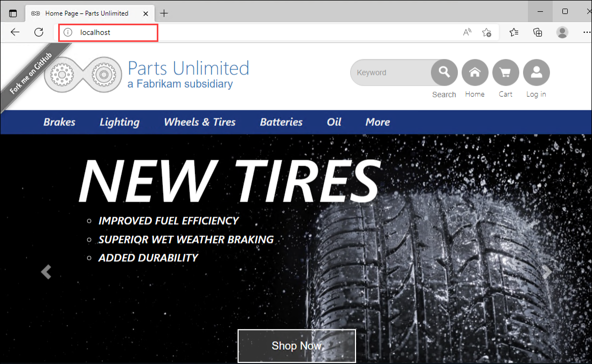

# Exercise 1: Review the Legacy On-Prem Application

In this lab we have provisioned a web application called **Parts Unlimited**, it is an ASP.NET two tier apllication runs on windows server with the sql server back-end and
webserver front-end.

1. On the microsoft edge browner window, enter **localhost** and you will be redired to the parts Unlimited web applicated hosted on ther web server.

   
   
2. Feel free to go through the web application. We will be migrating this web application from on-prem to Azure in the further exercises.
