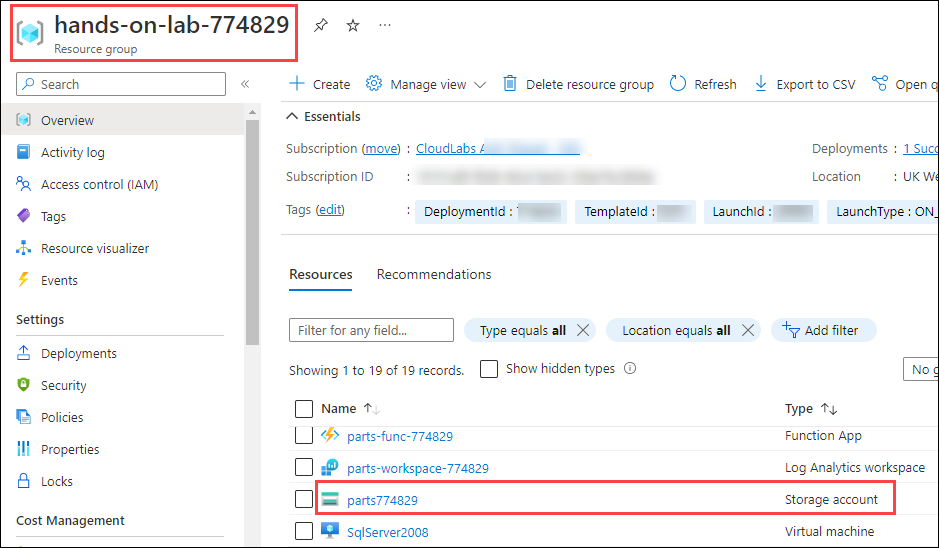
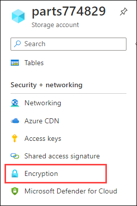
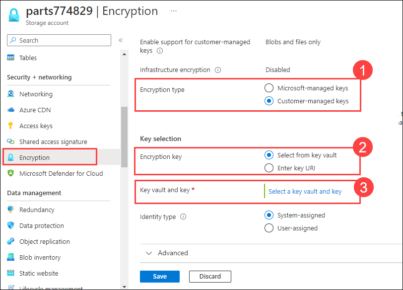
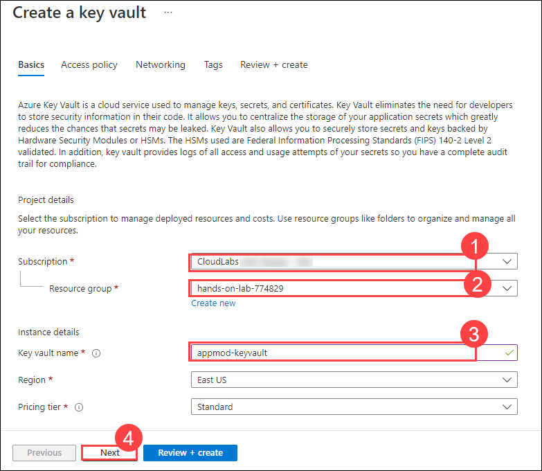
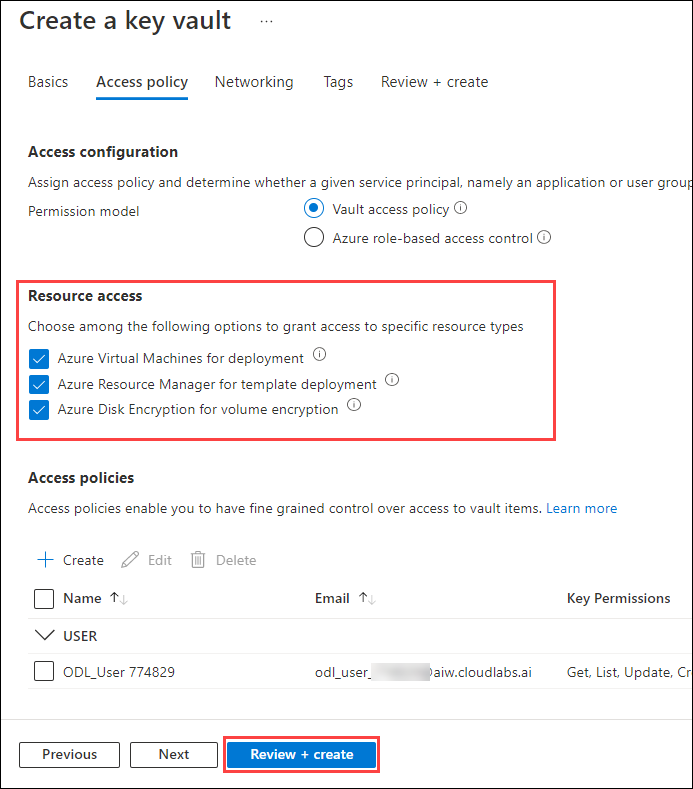
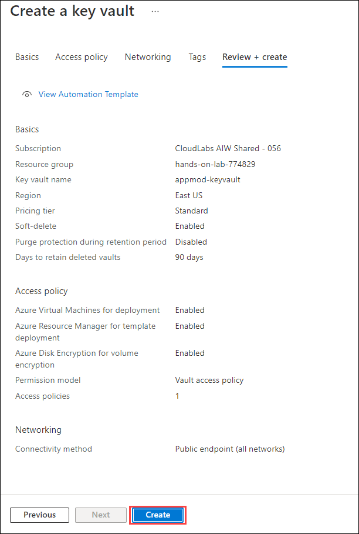
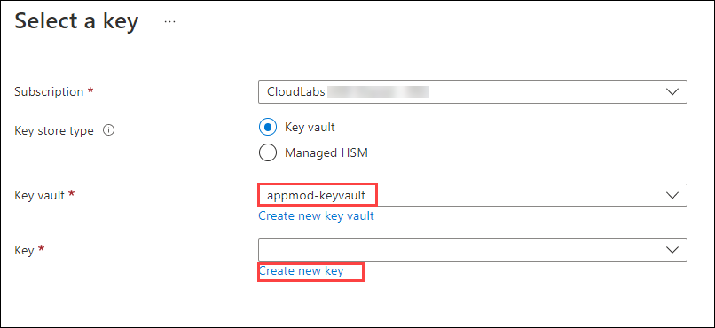
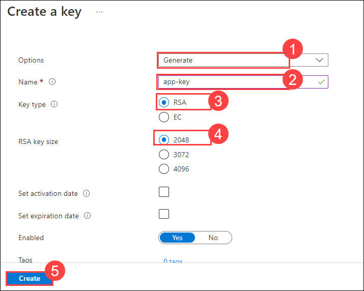
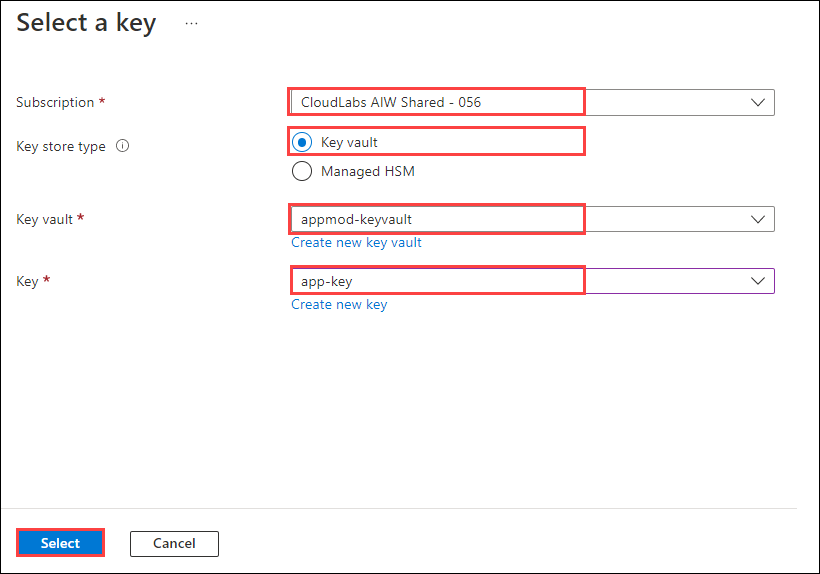
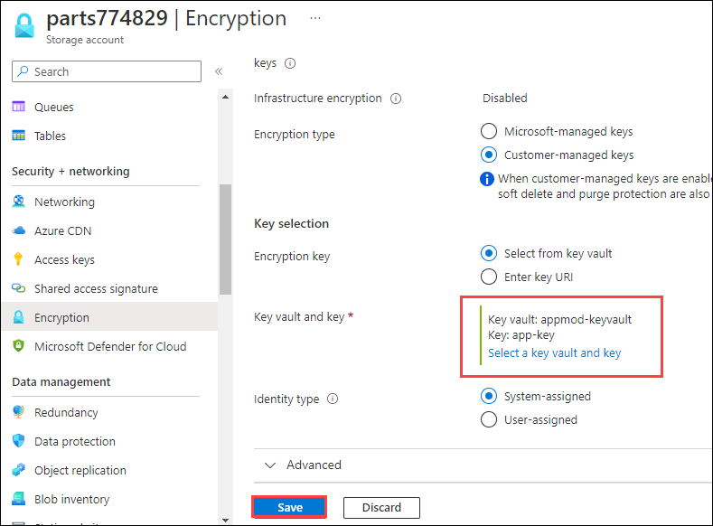

# Exercise 8: Data encryption using Azure key vault

In this task, you will create your own encryption key to protect the data in your storage account using a **customer-managed key**. When you specify a customer-managed key, that key is used to protect and control access to the key that encrypts your data. Customer-managed keys offer greater flexibility to manage access controls. 

**Data encryption** is the method of translating data into another form or code so that access to the data is limited to only those with the correct decryption key (or password). 

1. Navigate back to the **hands-on-lab-** resource group and select the storage account **partsxxxx**.

   
   
2. From the left navigation pane, under the **Security + Networking** section, Select **Encryption**.

   
   
3. On the **Encryption** pane, select **`customer-managed keys`** for **Encryption Type (1)** and **`Select from key vault`** option for **Encryption key (2)**. Click on the **select a key vault and key (3)** option next to the key vault and key.

   
   
4. On the **Select a key** page, select **key vault** for keystore type and click on the **create new key vault** option next to the key vault.

   
   
5. You will be redirected to **Create a key vault** page. Provide the following information for the key vault:

   - **Subscription**: Select your subscription **(1)**
   - **Resource group**: hands-on-lab-xxxx **(2)**
   - **Key vault name**: appmod-keyvault **(3)**
   - click on **Next (4)**
  
    
  
6. On the **Access policy** pane, check all the options under **Enable access to:** and click on **Review + create**.

   
   
7. On the "Review + create" page, click on **Create**.

   
  
7. Once the deployment is successfully finished, you will be redirected to **Select a key** page, and click on the **create a new key** option next to the key.

   
  
8. On the **Create a key** page, fill the following details:

   - **Options**: Generate **(1)**
   - **Name**: app-key **(2)**
   - **Key type**: RSA **(3)**
   - **RSA key size**: 2048 **(4)**
   - Leave all other values to default and click on **Create (5)**.

    
  
9. Once the key is generated successfully, you will be redirected to **Select a key** page, and click on **Select**.

   
   
10. Click on **Save** and wait until the changes to **Encryption** gets updated. Visit the encryption pane and observe the updated keys.

    
   
