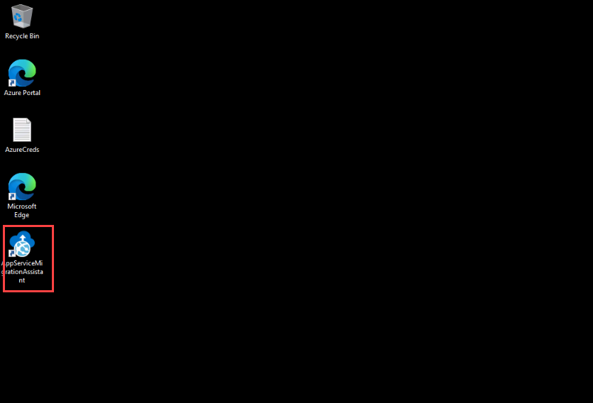
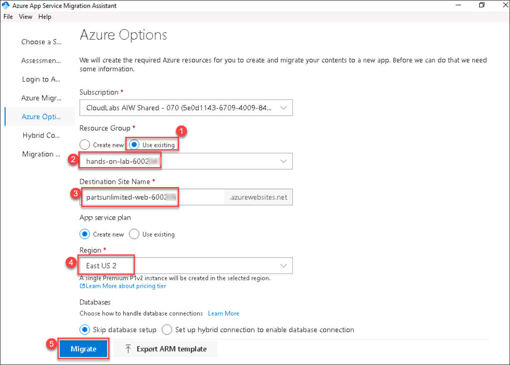
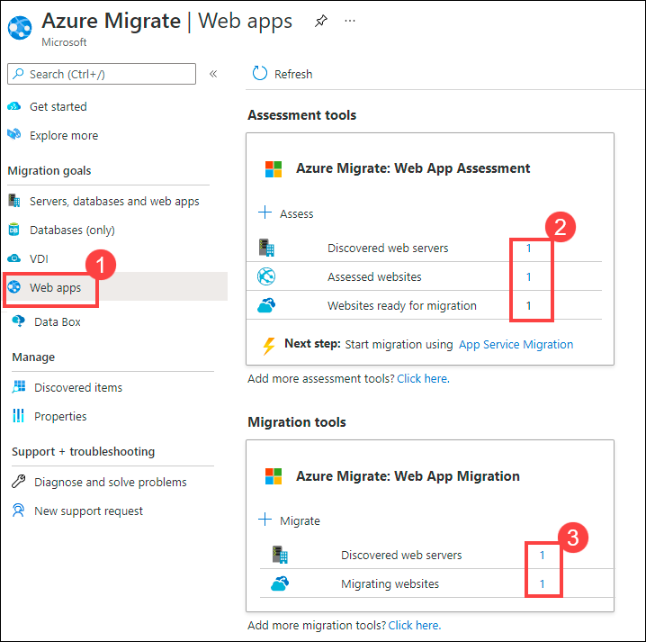

# Exercise 2: Migrate your application with App Service Migration Assistant

Duration: 20 minutes

The first step for Parts Unlimited is to assess whether their apps have dependencies on unsupported features on Azure App Service. In this exercise, you use an **Azure Migrate** tool called the App Service migration assistant to evaluate Parts Unlimited's web site for a migration to Azure App Service. The assessment runs readiness checks and provides potential remediation steps for common issues. Once the assessment succeeds, we will proceed with the migration as well. You will use a simulated on-premises environment hosted in virtual machines running on Azure.

## Task 1: Perform assessment for migration to Azure App Service

Parts Unlimited would like an assessment to see what potential issues they might need to address in moving their application to Azure App Service. You will use the [App Service migration assistant](https://appmigration.microsoft.com/) to assess the application and run various readiness checks.

1. In the Azure portal, navigate to your **WebVM** VM by selecting the **hands-on-lab-<inject key="DeploymentID" enableCopy="false"/>** resource group, and selecting the **WebVM** VM from the list of resources.

    

1. On the WebVM Virtual Machine's **Overview (1)** blade, copy the **Public IP address (2)**.

    

1. Open a new browser window and navigate to the IP Address you copied. You may see a different image on the webapp while accessing as there are multiple images moving on the webapp page.

    

1. Minimize the browser window and open **AppServiceMigrationAssistant** that is located on the Desktop.

    

1. Once App Service Migration Assistant discovers the web sites available on the server choose **Default Web Site (1)** for migration and select **Next (2)** to start assessment.

    

1. Observe the result of the assessment report. In our case, our application has successfully passed 13 tests **(1)** with no additional actions needed. Now that our assessment is complete, select **Next (2)** to proceed to the migration.

   

   > For the details of the readiness checks, see [App Service Migration Assistant documentation](https://github.com/Azure/App-Service-Migration-Assistant/wiki/Readiness-Checks).

## Task 2: Migrate the web application to Azure App Service

After reviewing the assessment results, you have ensured the web application is a good candidate for migration to Azure App Service. Now, we will continue the process with the migration of the application.

1. In order to continue with the migration of our web site Azure App Service Migration Assistant needs access to our Azure Subscription. Select **Copy Code & Open Browser** button to be redirected to the Azure Portal.

   

1. A new tab opens to the login page within the Edge browser. Right-click the text box and select **Paste (1)** to paste your login code. Select **Next** to give subscription access to App Service Migration Assistant.

    

1. Continue the login process with your Azure Subscription credentials. When you see the message that says **You have signed in to the Azure App Service Migration Assistant application on your device** close the browser tab and minimize the edge browser window to return to the App Service Migration Assistant Window.

    

1. Select the Azure Migrate project we created **(1)** in the previous exercise to submit the results of our migration. Select **Next** to continue.

    

1. In order to migrate Parts Unlimited web site, we have to create an App Service Plan. The Azure App Service Migration Assistant will take care of all the requirements needed. Select **Use existing (1)** and select the resource group **hands-on-lab-<inject key="DeploymentID" enableCopy="false"/>** **(2)** as your deployment target. App Service requires a globally unique Site Name, enter **partsunlimited-web-<inject key="DeploymentID" enableCopy="false"/>** **(3)** for **Destination Site Name**. Select the **<inject key="location" style="color:red" />** **(4)** region. Click **Migrate** **(5)** to start the migration process.

    

    > **WARNING:** If your migration fails with a **WindowsWorkersNotAllowedInLinuxResourceGroup (1)** It may be due to the incorrect region. Try the migration process again, but this time selecting correct Region.  
    >
    > 

1. We have just completed the migration of Parts Unlimited web site from IIS on a Virtual Machine to Azure App Service. Congratulations. Let's go back to the Azure Portal and look into Azure Migrate. Search for `migrate` **(1)** on the Azure Portal and select **Azure Migrate (2)**.

    

1. Switch to the **Web Apps (1)** section. See the number of discovered web servers, assessed websites **(2)** and migrated websites change **(3)**. Keep in mind that you might need to wait for 5 to 10 minutes for results to show up. You can use the **Refresh** button on the page to see the latest status.

    
    
    
    
    > **NOTE:** You will be performing the **Exercise 3** from the SQLVM. 
