# Exercise 7: Publish the application via Application Gateway and Firewall (Optional)

Duration: 20 minutes

## Task 1: Provision Azure Firewall

In this task, you will create an Azure Firewall.

1. On the Azure Portal **Home** page, type **Firewall (1)** and select **Firewalls (2)**.

    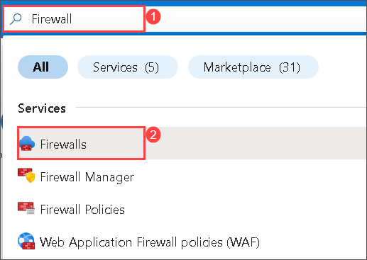
    
1. Click on **Create firewall** under the **Firewalls** page.

    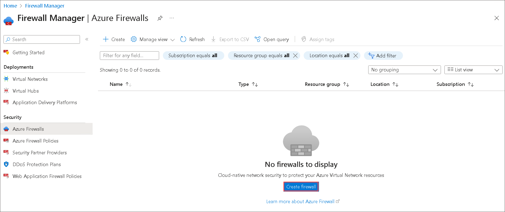
    
1. Under the **Basics** tab of the **Create a firewall** page, enter the below information:

    - Subscription: Choose your **Subscription (1)** from the drop-down list.
    
    - Resource group: Select **hands-on-lab-<inject key="DeploymentID" enableCopy="false"/> (2)** from the drop-down list
    
    - Name: Enter **firewall<inject key="DeploymentID" enableCopy="false"/> (3)**
    
    - Region: **<inject key="location" enableCopy="false" />** **(4)**
    
    - Firewall SKU: **Standard (5)**
    
    - Firewall management: **Use a Firewall Policy to manage this firewall (6)**

      .png)

    - Firewall policy: 
        * Click on **Add new (1)**
        * Enter Policy name as **appmod-policy (2)** 
        * Region as **<inject key="location" enableCopy="false"/>** **(3)**
        * Choose Policy tier as **Standard (4)**
        * Click on **OK (5)**
     
          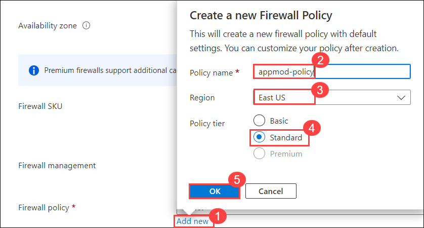
         
    - Choose a virtual network: **Create new**
     
    - Virtual network name: **app-vnet**
     
    - Address space: **10.0.0.0/16**
     
    - Subnet address space: **10.0.0.0/24**
     
      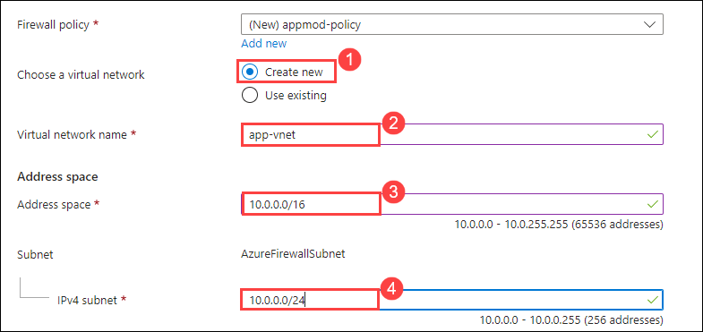
     
    - Public IP Address: 
      
      * Click on **Add new (1)**
      * Enter Name as **pip-firewall (2)** 
      * Click on **OK (3)**
     
        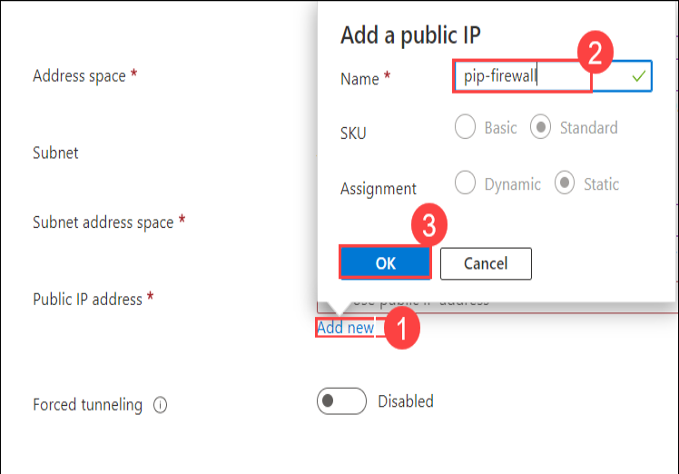

1. Select **Review + create**.
1. Review the configuration and select **Create**.

1. After creating the firewall successfully, click on **Go to resource**.

      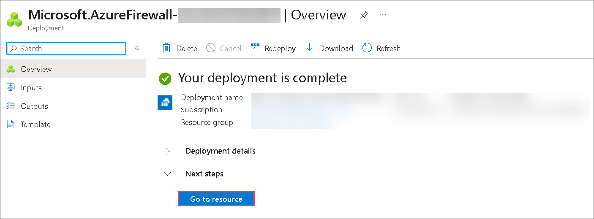
    
    > Note: The firewall might take up to 5 minutes to deploy.
  
1. Select **Firewall public IP** from the Overview page of **firewall**.

     .png)
    
1. Copy the **Public IP Address** of the firewall and note it down in the text editor. You will be using it in the next tasks.

     .png)

      <validation step="8a646075-bee9-4b8b-851d-a822975fa92d" />

## Task 2: Provision Application Gateway with WAF

In this task, you'll create an Application Gateway with WAF.  

1. On the Azure Portal **Home** page, type for **Application Gateways** and select to open it.

    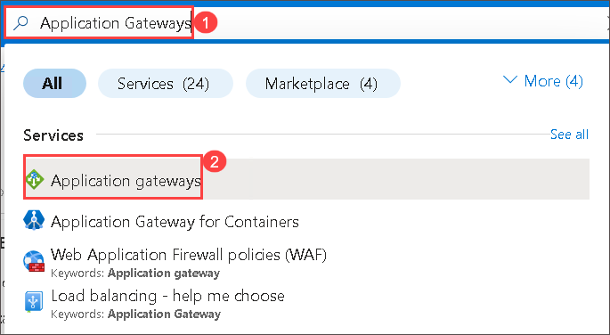
    
1. Click on **Create application gateway** from the Application gateway page.

    
     
1. On the **Basics** tab of **Create application gateway** page, enter the below details:

    - Subscription: Select your **Subscription (1)** from the drop-down list

    - Resource group: Select **hands-on-lab-<inject key="DeploymentID" enableCopy="false"/> (2)**

    - Application gateway name: Enter **appgateway<inject key="DeploymentID" enableCopy="false"/> (3)**

    - Region: **<inject key="location" enableCopy="false" />** **(4)**

    - Tier: **WAF V2 (5)**

    - Maximum instance count: **2 (6)**
    
    - HTTP2: **Disabled (7)**
    
    - WAF Policy: **Create new (8)** 

      .png)
      
1. On the **Create Web Application Firewall Policy** tab enter the **Name** as **appmodpolicy (1)** and click on **OK (2)**.

    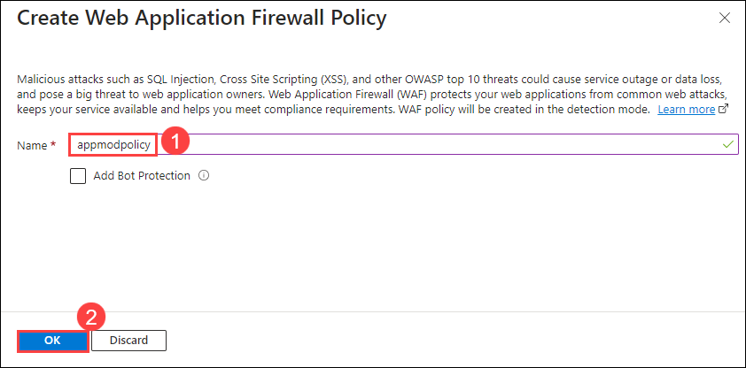

1. Now back on the **Basics** tab of **Create application gateway** page, enter the below details:

    - Virtual network: Select **hands-on-lab-<inject key="DeploymentID" enableCopy="false"/>-vnet (1)**

    - Subnet: Select **subnet2 (2)** subnet from the drop-down list.

    - Select **Next: Frontends (3)**

      .png)
        
1. Under the **Frontends** tab, Select **Both (1)** for **Frontend IP address type**, next click on **Add new (2)** under **Public IP address**, enter the name as **appmodpip (3)** and click on **OK (4)**
 
    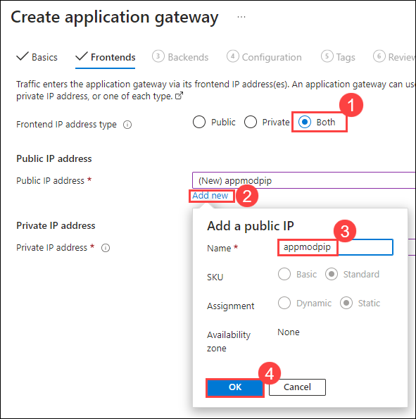
   
1. Next for **Private IP address** enter `176.16.1.100`. Next, select **Backends**. 

    
        
1. Under the **Backends** tab, select **Add a backend pool**

    
      
1. Under the **Add a backend pool** page, enter the below details:

    - Name: Enter **appmod-backend (1)**
    - Add backend pool without targets: Select **No (2)**
    - Target type: Select **Virtual Machine** from drop-down
    - Target: Select **WebVM-nic(3)** .
    - Select **Add (4)**

      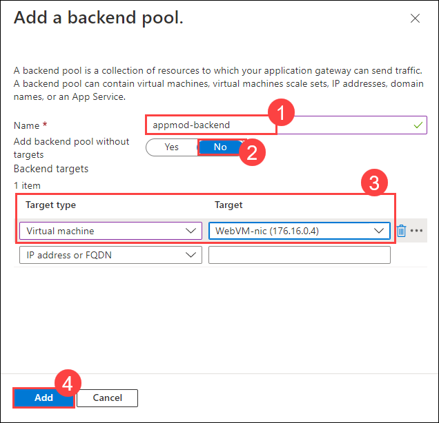
        
1. Now, select **Next: Configuration** under **Create application gateway**.

1. On the **Configuration** tab, select **+ Add a routing rule**.

    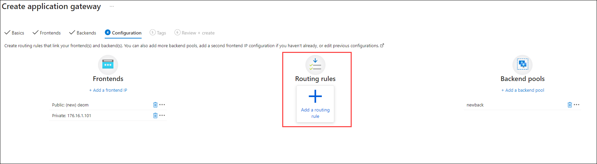
     
1. Now on the **Add a routing rule** page, enter the below details:

    - Name: **appmod-routingrule (1)**
    - Priority: **100 (2)** 
    - Listener name: **appmod-listener (3)**     
    - Frontend: Select **Private (4)** from the drop-down list
    - Now select **Backend targets (5)**

       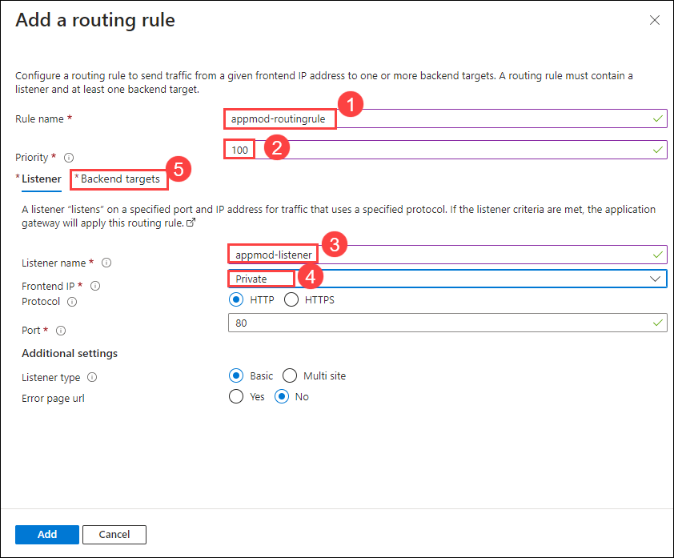
       
    - Under **Backend targets**, select Backend target as **appmod-backend (1)** and select **Add new (2)** for Backend Settings.

      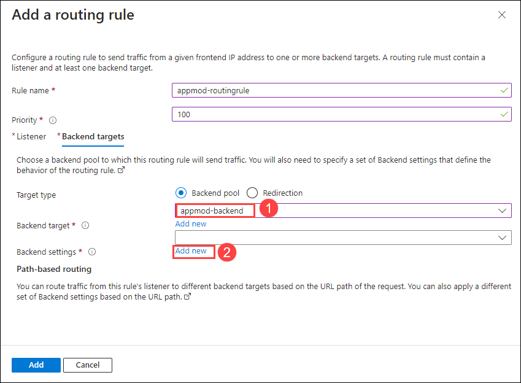
         
    - Under **Add Backend setting** page, enter **Backend settings name** as **appmod-http (1)** and click on **Add (2)**

      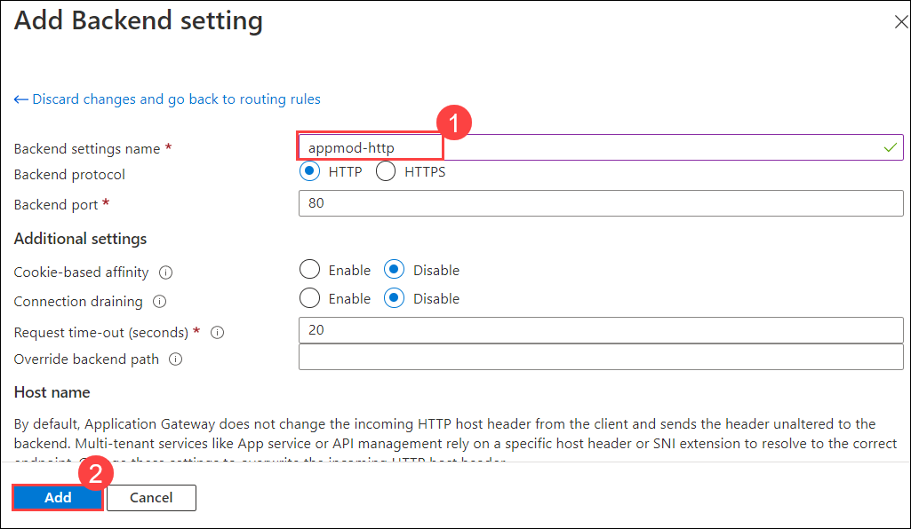
              
    - Click on **Add** under **Add a routing table** page.

        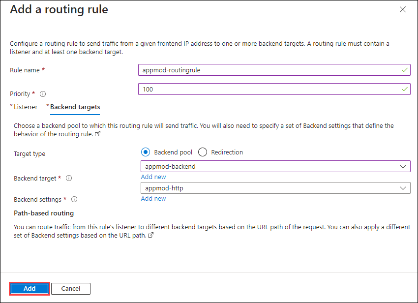
        
1. Click on **Next: Tags** from **Create application gateway** page.

1. Select **Review + create**, from Create application gateway.

     
      
1. Review the configuration and select **Create**.

    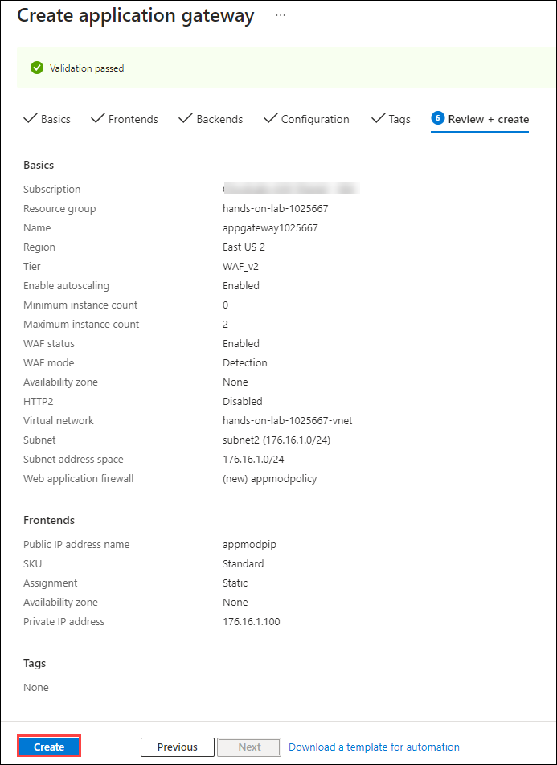
      
1. After the deployment is successful, click on **Go to resource group**.
   
    > **Note**: The deployment will take up to 20 minutes to complete.

    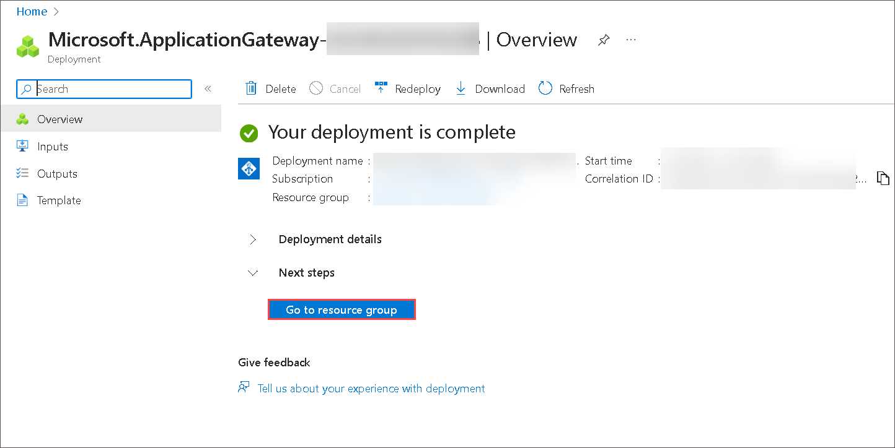
      
1. Navigate to the overview page of the resource group and ensure that you are able to see the deployed Application gateway and click on it.

   .png)
     
1. Copy the **Private IP address** from the overview page and note it down in the text editor. You will use it in upcoming tasks.

   .png)

    <validation step="209024f4-62cf-451f-911d-db4f59dde8f4" />

## Task 3: Publish Application via Azure Firewall & Application Gateway.             

In this task, you'll publish an application via Azure Firewall and Application Gateway.

1. On the Azure Portal **Home** page, search for **Firewall** and select it.

    
    
1. Click on the firewall **firewall<inject key="DeploymentID" enableCopy="false"/>**.

    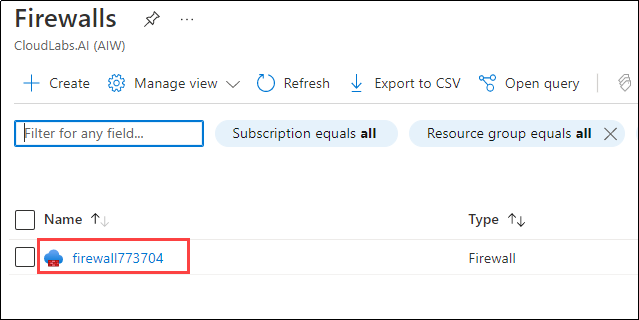
     
1. Select **Firewall Manager (1)** from **Settings** and click on **Visit Azure Firewall Manager to configure and manage this firewall (2)**

    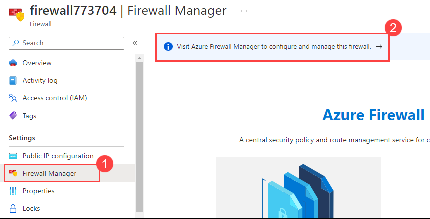
    
1. Select **Azure Firewall Policies (1)** from the **Firewall Manager** page and click on Firewall Policy **appmod-policy (2)**.

    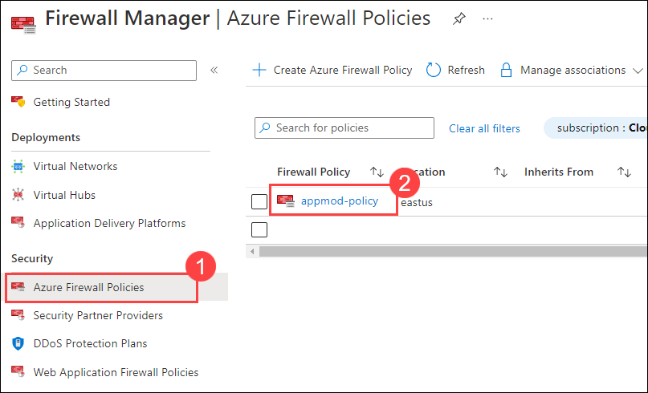
   
1. Select **DNAT Rules (1)** under the **Settings** section from the **Firewall Policy** page and select **+ Add a rule collection (2)**

    
    
1. Under **Add a rule collection** page, enter the below details:

    - Name: **appmod-firewall-rulecollection (1)**
    
    - Rule Collection type: **DNAT (2)**
    
    - Priority: **100 (3)**
    
    - Rule collection group: **DefaultDnatRuleCollectionGroup (4)**
    
    - Under **Rules (5)** mention the below details:
      
      - Name: **appmod-dnat-http**
      
      - Source type: Select **IP Address** from the drop-down list
      
      - Source: Enter *
      
      - Protocol: Select **TCP** from the drop-down list
      
      - Destination Ports: **80**
      
      - Destination (Firewall IP): Enter the IP address of the **Firewall** that you copied in the task-1
      
      - Translated type: Select **IP Address** from the drop-down list
      
      - Translated address: Enter the Private IP address of **Application gateway**. 
      
      - Translated port: **80**
     
     - Click on **Add (6)**

       .png)
          
1. Now, to test the application, copy and paste the IP address of **Application Gateway** into a new browser tab.

    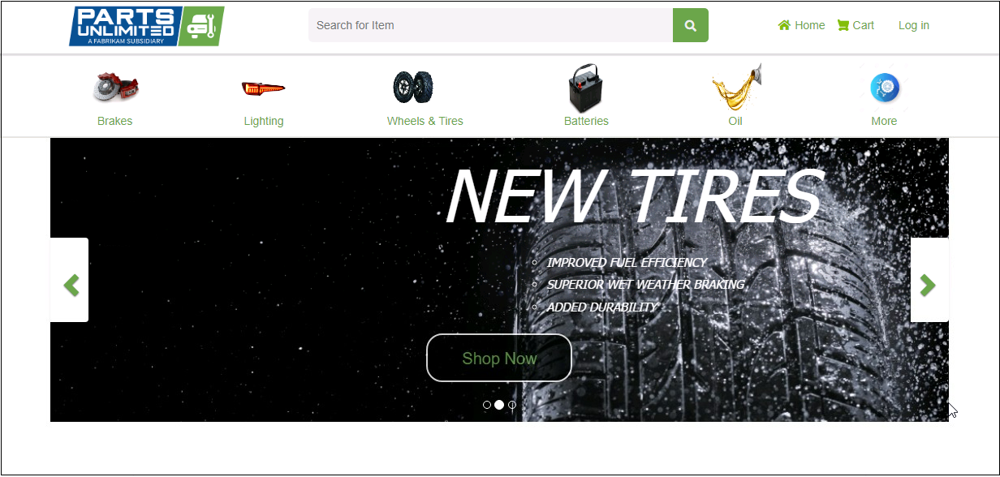
       
1. This will confirm that you have published the Parts Unlimited web application via Azure Firewall & Application Gateway.

    <validation step="697db361-21d6-4043-b2ad-8ff9f1a9e9e9" />

## Summary
 
In this exercise, you have covered the following:
  
   - Created an Azure Firewall and Application Gateway. 
   - Published an Application via Firewall and Application Gateway. 
   
