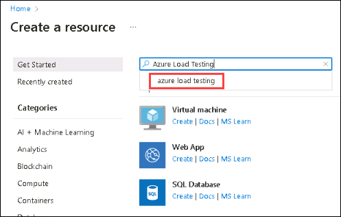
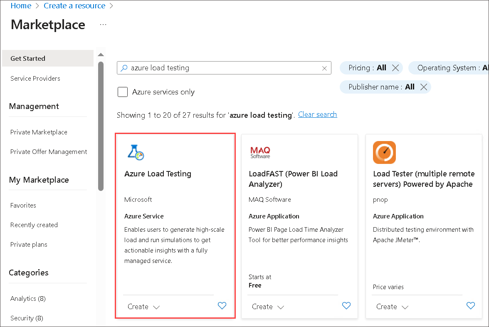
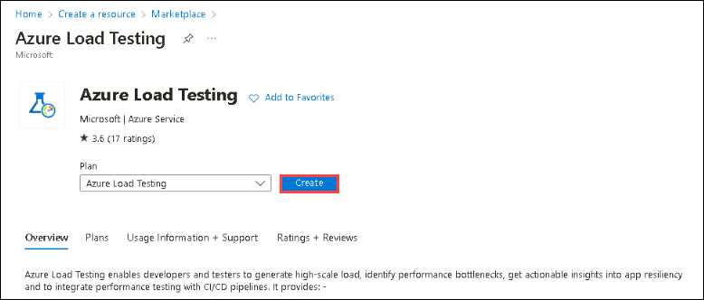
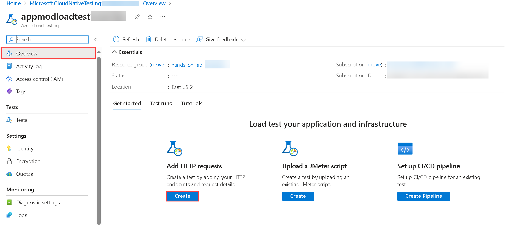
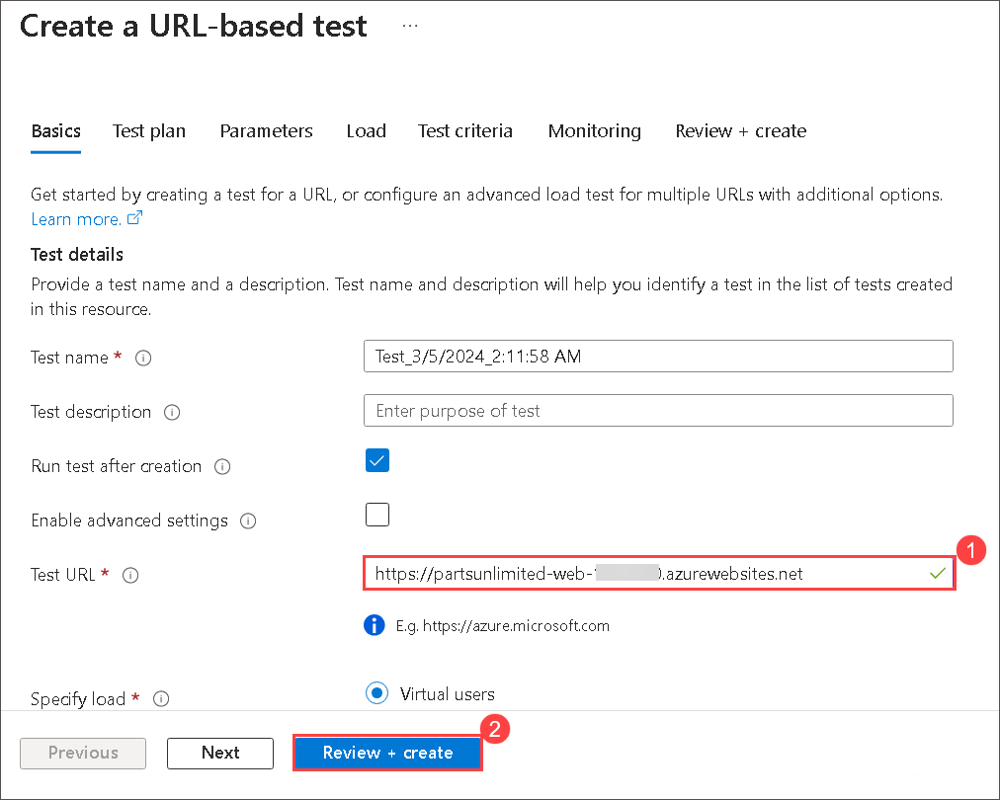
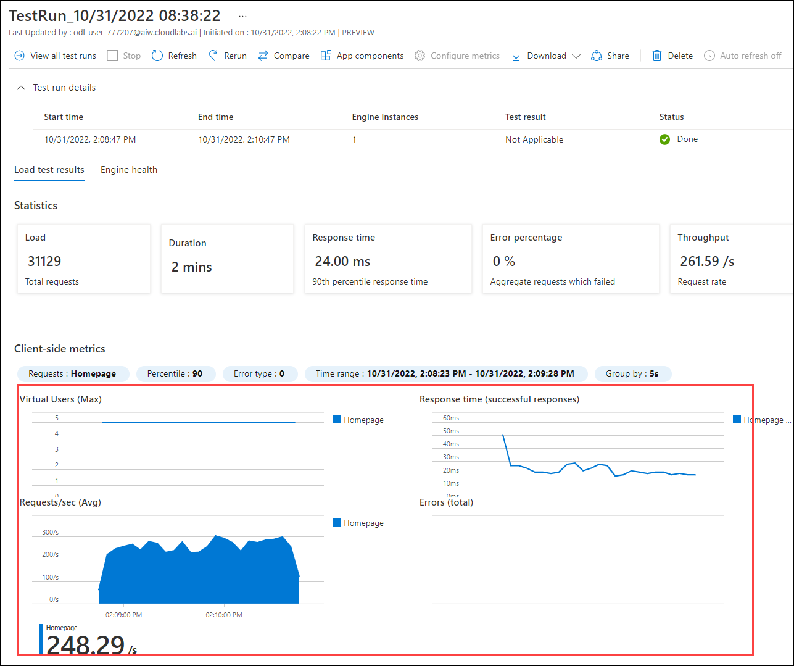

# Exercise 8: Performance testing of web app (Optional)

Duration: 30 minutes

Azure Load Testing Preview is a fully managed load-testing service that enables you to generate a high-scale load. Regardless of where your applications are hosted, the service simulates traffic for them. It can be used by programmers, testers, and quality assurance (QA) engineers to enhance the speed, scalability, or capacity of applications.

Azure Load Testing is currently in preview because of this we have limited options available as of now.

In this task, we will see how to load test the partsunlimited web application with Azure Load Testing (Preview) from the Azure portal.

1. First, you will create an Azure Load Testing resource. In the Azure portal, click on the **Show portal menu (1)** and select **+ Create a resource (2)**.

   

2. Search for Azure Load Testing in the search box and select **Azure load testing** from the suggestions.
 
   

3. Select **Azure Load Testing**.

    

4. Select **Create** on the Azure Load Testing pane.
 
    

5. Provide the following information to configure the Load test:

   - **Subscription:** Make sure **your subscription (1)** is selected by default.
   
   - **Resource group:** Select **hands-on-lab-<inject key="DeploymentID" enableCopy="false"/>** **(2)** resource group from the drop-down
   
   - **Name:** provide **appmodloadtest<inject key="DeploymentID" enableCopy="false"/>** as the name for the load test resource **(3)**.
   
   - **Location:** **East US** **(4)**.
   
   - Click on **Review + create (5)**
 
      .png)
    
6. Post the validation passes, and click on **Create**.

    .png)

7. Click on **Go to resource** to view the resource upon successful deployment.

    .png)

8. Here, you will create a load test by using the web application URL.

9. On the **Overview** page, select **Create** for **Add HTTP request** given under _Load test your application and infrastructure_.

    

10. On the Quick test page, provide the following details:

   - **Test URL:** Enter **https://partsunlimited-web-<inject key="DeploymentID" enableCopy="false"/>.azurewebsites.net** **(1)**
   
   -  The Rest of the details are optional. Default values are already updated for all the tasks.
   
   -  Click on **Review + create (2)**. This will create and start the load test.

      

11. Once the load test begins, you will be directed to the test run dashboard. Azure Load Testing records both client-side and server-side metrics while the load test is underway. 

12. On the dashboard, you will see the client-side metrics in real-time while the test is running. The data refreshes every five seconds by default.

    

  > **Congratulations** on completing the task! Now, it's time to validate it. Here are the steps:
	
  - Hit the Validate button for the corresponding task. If you receive a success message, you can proceed to the next task. 
  - If not, carefully read the error message and retry the step, following the instructions in the lab guide.
  - If you need any assistance, please contact us at labs-support@spektrasystems.com. We are available 24/7 to help you out.

<validation step="360e7060-9438-4318-b306-0b390bf00adc" />
    
## Summary
 
In this exercise, you have covered the following:
  
   - Created an Azure Load Testing resource. 
   - Tested the Parts Unlimited web application with Azure Load Testing (Preview) from the Azure portal. 
