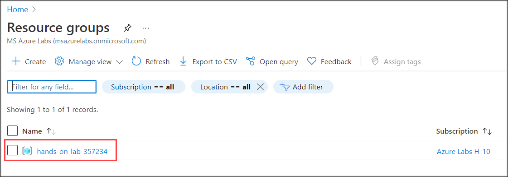
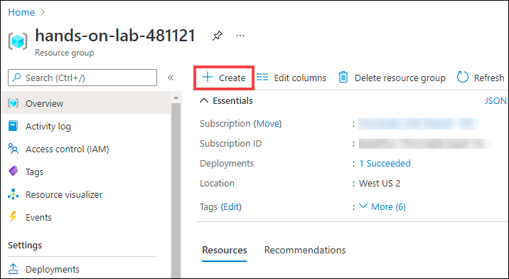

# Exercise 9: Securing web app secrets with Azure Key Vault and Managed Identity

## Task 1: Setting up Azure Key vault

1. Select your **resource group**. 

   

1. Select **Create** inside the resource group to add a new resource.

    
