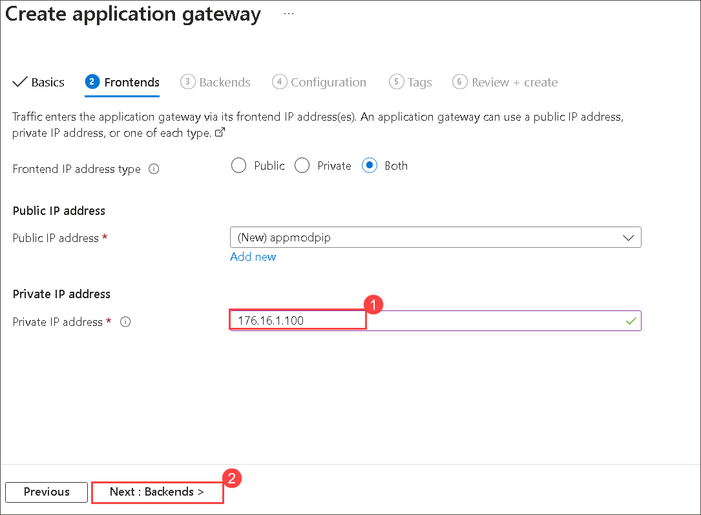
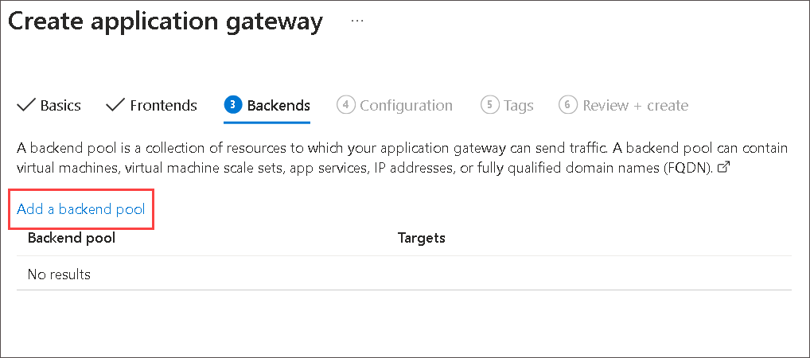
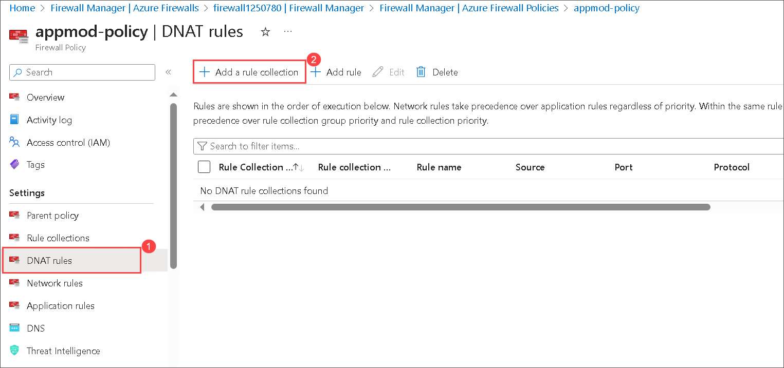

# .NET App Modernization
---
### Overall Estimated Duration: 4.5 Hours

## Overview
In this hands-on lab, you will migrate a legacy on-premises application to Microsoft Azure using various Azure services and tools. Over the years, cloud computing has revolutionized how applications are hosted and managed, offering benefits such as scalability, security, and reduced infrastructure overhead. Azure provides a comprehensive suite of tools and services to facilitate the seamless migration of applications and databases from on-premises environments to the cloud.

In this lab, we will guide you through the process of setting up Azure Migrate, assessing your existing on-premises application, and migrating it to Azure App Service using the App Service Migration Assistant. You will also learn how to migrate on-premises databases to Azure SQL Database and enhance the application's functionality with Azure's serverless offerings, such as Azure Functions. Additionally, we'll cover the setup of a CI/CD pipeline using GitHub Actions to automate deployments and explore advanced topics like securing application secrets with Azure Key Vault, performance testing, and deploying the application using Azure Application Gateway and Firewall. 

By the end of this lab, you will gain hands-on experience in modernizing applications for the cloud, implementing cloud-native services, and leveraging Azure's capabilities to improve scalability, security, and performance.

## Objectives
In this lab, you will learn how to migrate and modernize an on-premises application to Azure, implement DevOps practices, utilize serverless computing, and secure applications. By the end of this lab, you will be able to:

   - **Review the Legacy On-Prem Application**: Understand the existing on-premises application architecture and dependencies to identify migration requirements and potential challenges.

   - **Setting up Azure Migrate**: Set up Azure Migrate to assess the on-premises environment, preparing it for a seamless migration to Azure.

   - **Migrate your application with App Service Migration Assistant**: Use the App Service Migration Assistant to transfer the legacy web application to Azure App Service with minimal downtime, ensuring business continuity.

   - **Migrate On-Premises Database to Azure SQL Database**: Migrate the on-premises database to Azure SQL Database to leverage managed database services and ensure high availability.

   - **Setup CI/CD pipeline with GitHub Actions for the web app**: Set up a continuous integration and continuous deployment (CI/CD) pipeline using GitHub Actions to automate the build, test, and deployment processes for the web application.

   - **Using serverless Azure Functions to process orders**: Develop and deploy serverless Azure Functions to handle order processing, reducing infrastructure management overhead and enhancing scalability.

   - **Publish the application via Application Gateway and Firewall (Optional)**: Use Azure Application Gateway and Firewall to enhance the security and performance of the application's deployment, providing improved traffic management and protection.

   - **Performance testing of web app (Optional)**: Perform performance testing to identify any bottlenecks and ensure the web application meets performance standards after migration.

   - **Securing web app connection string with Azure Key Vault and Managed Identity (Optional)**: Enhance the security of the web application by using Azure Key Vault and Managed Identity to securely manage and access sensitive connection strings.

## Pre-requisites
- **Basic Knowledge of Azure Migrate**: Understanding the purpose and features of Azure Migrate.
- **Familiarity with Azure App Service**: Knowledge of Azure App Service features and configuration.
- **Basic Knowledge of Azure SQL Database**: Understanding of Azure SQL Database features and configuration.
- **Experience with GitHub Actions**: Understanding of CI/CD concepts and experience with setting up GitHub Actions workflows.
- **Understanding of Serverless Computing**: Basic knowledge of serverless architecture and its use cases.
- **Basic Knowledge of Azure Key Vault and Managed Identity**: Understanding of how these services can be used to manage and secure sensitive information.

## Architecture
In this hands-on lab, the architecture flow begins by using Azure Migrate to assess and migrate Parts Unlimited's E-Commerce website to Azure App Service, confirming compatibility with the App Service Migration Assistant tool. The Data Migration Assistant (DMA) then verifies that the database can be moved to Azure SQL Database without issues. A private GitHub repository is set up for the codebase, and deployment slots for staging and production are configured, with GitHub Actions automating the CI/CD pipeline. Finally, Parts Unlimited adopts a serverless architecture for its order processing system, utilizing Azure Functions and Azure Storage Queue for scalable, asynchronous processing, supported by Azure Blob Storage for invoices and Azure Application Insights for monitoring.

> **Note:** The solution provided is only one of many possible, viable approaches.

## Architecture Diagram

## Explanation of Components

- **Azure App Service**: A managed platform for deploying and scaling web applications and APIs, supporting multiple languages with built-in security, auto-scaling, and load balancing.
- **Azure SQL Database**: A fully managed relational database service for storing application data, providing high availability, scalability, and security.
- **Azure Queue Storage**: A message queuing service for storing large numbers of messages to enable reliable and decoupled communication between application components.
- **Azure Functions**: A serverless compute service that executes code in response to events, used here for processing orders and managing business logic dynamically.
- **Azure Blob Storage**: A scalable object storage solution for unstructured data, used to store invoices and other multimedia files with high durability and availability.
- **Azure Application Insights**: An application performance management tool that provides real-time monitoring, diagnostics, and analytics to ensure optimal app performance.
- **GitHub Actions**: A CI/CD tool integrated with GitHub for automating build, test, and deployment workflows, ensuring continuous integration and delivery.

## Getting Started with Lab

1. Once the environment is provisioned, a virtual machine (JumpVM) and lab guide will get loaded in your browser. Use this virtual machine throughout the workshop to perform the lab. You can see the number on the lab guide bottom area to switch to different exercises of the lab guide.
   

   

1. To get the lab environment details, you can select the **Environment Details** tab. Additionally, the credentials will also be emailed to your email address provided during registration. You can also open the Lab Guide on separate and full window by selecting the **Split Window** from the lower right corner. Also, you can start, stop, and restart virtual machines from the **Resources** tab.

   
 
    > You will see SUFFIX value on the **Environment Details** tab, use it wherever you see SUFFIX or Deployment ID in lab steps.

## Login to Azure Portal

1. In the JumpVM, click on the Azure portal shortcut of Microsoft Edge browser from the desktop.

   

1. In the Welcome to Microsoft Edge page, select **Start without your data** and on the help for importing Google browsing data page select **Continue without this data** button and proceed to select **Confirm and start browsing** on the next page.
   
1. On **Sign in to Microsoft Azure** tab you will see login screen, enter following email/username and then click on **Next**. 
   * Email/Username: <inject key="AzureAdUserEmail"></inject>
   
     
     
1. Now enter the following password and click on **Sign in**.
   * Password: <inject key="AzureAdUserPassword"></inject>
   
     
     
1. If you see the pop-up **Stay Signed in?**, click No

1. If you see the pop-up **You have free Azure Advisor recommendations!**, close the window to continue the lab.

1. If a **Welcome to Microsoft Azure** popup window appears, click **Cancel** to skip the tour.
   
1. Now you will see Azure Portal Dashboard, click on **Resource groups** from the Navigate panel to see the resource groups.

    
   
1. Confirm you have a resource group present with name **hands-on-lab-<inject key="DeploymentID" enableCopy="false" />**. Last six digits in the resource group name are unique for every user.

    
   
1. Now, click on Next from the lower right corner to move to the next page.

## Support Contact
 
1. The CloudLabs support team is available 24/7, 365 days a year, via email and live chat to ensure seamless assistance at any time. We offer dedicated support channels tailored specifically for both learners and instructors, ensuring that all your needs are promptly and efficiently addressed.
 
   Learner Support Contacts:
 
   - Email Support: labs-support@spektrasystems.com
   - Live Chat Support: https://cloudlabs.ai/labs-support
 
1. Now, click on Next from the lower right corner to move on to the next page.
## Happy Learning!!
